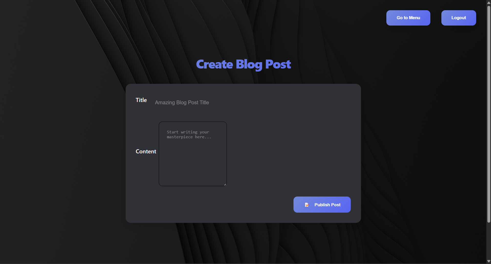
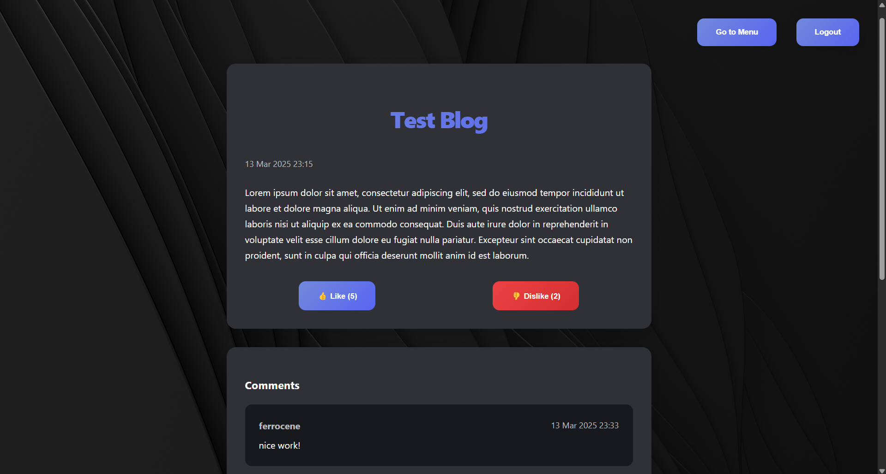

# ThunderClap: Chat & Blog Application
 
ThunderClap is a modern Spring Boot web application that seamlessly integrates real‑time chat and a blog platform. Authenticated users can join live chat sessions and post articles with rich content.

---

## Features

- **Real-Time Chat Room:**
  - WebSocket-based communication for instant messaging.
  - Supports sending text , images and audio together.
  - Session-based authentication ensures secure chat access.

- **Blog Platform:**
  - Authenticated users can create, view, and interact with blog posts.
  - Blog posts support text and images.
  - Users can like/dislike posts and add comments.

- **User Authentication:**
  - Form-based login with session management.
  - Protected routes and content accessible only to signed‑in users.

---

## Technologies Used

- **Backend:**
  - Spring Boot
  - Spring WebSocket & SockJS (with STOMP)
  - Spring Security (session-based authentication)
  - Spring Data JPA
  - H2 Database (for development; configurable for production)

- **Frontend:**
  - Thymeleaf templating
  - HTML5, CSS3, JavaScript
  - Responsive design with custom styling

---

## Getting Started

### Prerequisites

- Java 17 or later
- Maven or Gradle
- An IDE (e.g., IntelliJ IDEA, Eclipse)

---

## Installation & Build

1. **Clone the Repository:**

   ```bash
   git clone https://github.com/enigmapulse/ThunderClap.git
   cd thunderclap

2. **Build the Project:**

   For Maven, run:
   ```bash
   mvn clean install
   ```

   For Gradle, run:
   ```bash
   ./gradlew build
   ```

---

## Database Configuration

By default, ThunderClap uses an in‑memory H2 database for development.  
To use an external (online) database, update the following properties in `src/main/resources/application.properties`:

```properties
spring.datasource.url=jdbc:mysql://<your-online-db-host>:3306/<your-db-name>?useSSL=false&serverTimezone=UTC
spring.datasource.username=<your-db-username>
spring.datasource.password=<your-db-password>
spring.datasource.driver-class-name=com.mysql.cj.jdbc.Driver

# JPA configuration
spring.jpa.hibernate.ddl-auto=update
spring.jpa.database-platform=org.hibernate.dialect.MySQL8Dialect
```

Replace `<your-online-db-host>`, `<your-db-name>`, `<your-db-username>`, and `<your-db-password>` with your database credentials.

---

## Running the Application

Start the application using your IDE or via the command line:

```bash
mvn spring-boot:run
```

Once the application is running, visit [http://localhost:8080](http://localhost:8080)  

---

## Usage

1. **Welcome & Login:**
   - The root URL loads the static welcome page.
   - Users can log in via the form-based login page.


<div align="center">
Welcome Page
</div>


<div align="center">
  Login Page
</div>


2. **Chat Room:**
   - Access the real‑time chat room to send text , images and audio together.
   - Messages are broadcast live using WebSocket and STOMP.
     
   
<div align="center">
Public Chat
</div>


<div align="center">
  Private Chat
</div>


3. **Blog Platform:**
   - Visit `/blogs` to view all blog posts.
   - Create a new blog post at `/blogs/new`.
   - View individual posts, like/dislike them, and add comments.


<div align="center">
  Blog Main Screen
</div>


<div align="center">
  Create New Blog
</div>


<div align="center">
  View of Blog
</div>


---

## Contributing

Contributions are welcome! Contributions are made by Navneet Kashyap, Siddhant Tiwari, Siddarth Bailkeri, and Madhavan Saini. Please fork the repository and submit a pull request following standard GitHub contribution guidelines.

---

## License
This project is licensed under the MIT License - see the [LICENSE](LICENSE) file for details.

---**
